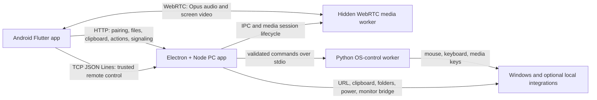

# Smart MPC

Smart MPC adalah sistem kontrol PC melalui Android yang bekerja sepenuhnya di
jaringan lokal. Satu aplikasi Android terhubung ke satu server Windows untuk
menjalankan quick action, memindahkan file dan clipboard, mengendalikan mouse dan
keyboard, menerima audio PC, serta melihat layar PC secara langsung.

Release saat ini: **3.0.0**

Smart MPC tidak membutuhkan cloud, akun daring, STUN, atau TURN. Android dan PC
harus berada di jaringan lokal yang sama.

## Fitur Utama

### Actions

- Menjalankan quick action dari aplikasi atau NFC/deep link.
- Mengirim satu atau beberapa file Android ke inbox PC dengan status progres.
- Menampilkan isi outbox PC dan mengunduh file ke Android.
- Mengirim clipboard Android ke PC dan menarik clipboard PC ke Android.
- Membuka URL di PC.
- Membuka inbox/outbox, membuka Chrome, mengunci PC, dan membuat PC sleep.
- Memilih profil monitor melalui bridge lokal opsional.

### Remote

- Trackpad full-screen dengan pergerakan pointer relatif dan respons real-time.
- Klik kiri, klik kanan, klik tengah, scroll, dan drag-hold dua jari.
- Gesture browser back dan forward.
- Live typing dari keyboard Android dan voice dictation.
- Tombol Alt+Tab, Enter, arrow keys, Backspace, F5, Copy, dan Paste.
- Kontrol media PC: previous, play/pause, next, stop, mute, dan volume.

### Media

- Streaming system audio PC ke Android memakai WebRTC dan Opus 48 kHz.
- Output Android memakai media volume dan jalur low-latency.
- Audio dapat tetap aktif saat aplikasi berada di background atau layar terkunci.
- Foreground media service, notification, dan lock-screen media control.
- Kontrol audio global tetap dapat diakses saat berada di tab lain.
- Capture mengikuti audio output Windows yang sedang aktif.

### Mirror

- Live mirror primary display PC melalui WebRTC.
- H.264/VP8, native source resolution, maksimum 30 fps, dan adaptive bitrate.
- Mode landscape immersive dengan cursor PC terlihat.
- Worker hanya aktif ketika mirror digunakan.
- Mirror production bersifat view-only; kontrol PC dilakukan melalui tab Remote.

### Connect

- Manual PC address atau auto-discovery melalui UDP broadcast.
- Pairing token untuk mendaftarkan Android sebagai trusted device.
- Device credential disimpan lokal untuk auto-connect berikutnya.
- Discovery otomatis menangani perubahan alamat IP lokal PC.
- Trusted device dapat dicabut dari PC dan local trust dapat dibersihkan di Android.

## PC Server

PC Server adalah aplikasi Electron yang berjalan di system tray dan otomatis
menyalakan server lokal. Klik tray icon untuk membuka dashboard.

Dashboard menyediakan:

- status server dan alamat lokal;
- pairing token dengan tombol copy;
- trusted-device list dan revoke;
- inbox, outbox, dan add files to outbox;
- activity log;
- opsi Run at startup.

Jendela boleh ditutup tanpa mematikan server. Gunakan menu **Quit** pada tray jika
ingin menghentikan aplikasi sepenuhnya.

## Arsitektur



### Komponen

- `android_app/`: aplikasi Flutter, NFC launcher, remote UI, dan media WebRTC.
- `pc_app/`: Electron shell, Node server, trust authority, API, signaling, dan tray.
- `pc_worker/`: worker Python untuk input mouse, keyboard, dan media key Windows.
- `shared_protocol/`: kontrak auth, endpoint, channel, command, dan event.
- `docs/`: catatan fase, audit parity, checklist, dan migrasi media.
- `scripts/`: setup runtime, menjalankan source, dan build worker.

### Transport

| Port | Transport | Fungsi |
| --- | --- | --- |
| `8765` | HTTP | Pairing, API, file, clipboard, action, dan WebRTC signaling |
| `8080` | TCP JSON Lines | Remote control terautentikasi |
| `8081` | UDP | PC discovery dan compatibility audio lama |
| `8082` | TCP | Compatibility screen transport lama |

Media production menggunakan host candidate WebRTC lokal dengan port dinamis.
Transport PCM/UDP dan TCP/JPEG lama dipertahankan untuk compatibility, tetapi UI
production memakai WebRTC.

## Model Keamanan

- Pairing awal membutuhkan pairing token dari PC Server.
- Pairing menghasilkan device ID dan device token yang disimpan lokal.
- API terlindungi memverifikasi trusted-device credential.
- Realtime control mewajibkan autentikasi pada pesan pertama.
- Command PC melewati whitelist dan validasi sebelum diteruskan ke worker.
- Session media dimiliki oleh trusted device yang membuatnya.
- Token, konfigurasi runtime, inbox, outbox, log, build, dan file lokal diabaikan Git.

Smart MPC dirancang untuk LAN tepercaya. Jangan meneruskan port server ke internet
atau menjalankannya pada jaringan publik yang tidak dipercaya.

## Lifecycle dan Resource

- Worker kontrol dibuat saat command remote pertama dibutuhkan.
- Hidden media worker dibuat saat audio atau mirror mulai digunakan.
- Video berhenti saat pengguna keluar dari Mirror.
- Audio dapat tetap berjalan tanpa video ketika diminta pengguna.
- Saat audio dan video sama-sama off, peer, track, renderer, lock, dan worker media
  dilepas.
- Server idle di tray tidak otomatis menjalankan semua worker dan capture.

## Integrasi Opsional

### Monitor profile

Command profil monitor menggunakan service lokal lain pada PC yang sama:

```text
http://127.0.0.1:47777/profile/{id}
```

Service tersebut tidak diekspos ke Android. Android mengirim command tepercaya ke
Smart MPC PC Server, lalu server meneruskannya ke loopback API.

### Chrome profile

Profil Chrome dapat dikonfigurasi pada `pc_app/config.json` lokal melalui field
`chrome_profile`. File konfigurasi tersebut tidak masuk Git.

## Perjalanan Pengembangan

Smart MPC dibangun dari dua prototype lokal yang sebelumnya menangani NFC quick
action dan remote/media secara terpisah. Keduanya tetap independen dan hanya
digunakan sebagai referensi read-only.

Tahapan utama yang telah dilalui:

1. **Feature lock**: seluruh fungsi prototype didata sebelum integrasi dimulai.
2. **Unified foundation**: Android, Electron/Node, Python worker, dan shared
   protocol disusun sebagai satu produk.
3. **Initial integration**: pairing, files, clipboard, NFC, remote, audio, dan
   mirror dipindahkan ke shell gabungan.
4. **Forensic parity repair**: alur sintaks, layout, gesture, sensitivitas,
   kompresi, lifecycle, dan edge case dibandingkan kembali dengan implementasi
   yang sudah teruji. Prinsip akhirnya adalah port and adjust, bukan membuat ulang.
5. **Workflow stabilization**: auto-discovery, auto-connect, file progress,
   full-screen remote, tray startup, media controls, dan monitor bridge dirapikan.
6. **Production media migration**: transport audio PCM/UDP dan video JPEG diganti
   pada UI production dengan WebRTC yang terisolasi dari NFC, trackpad, file, dan
   fitur stabil lainnya.
7. **Release 3.0.0**: audio Opus, mirror WebRTC, Android media lifecycle, transport
   probes, packaged PC Server, dan APK release diverifikasi bersama.

Catatan proses lebih rinci:

- [Feature Lock](docs/PHASE_0_FEATURE_LOCK.md)
- [Forensic Porting Rules](docs/FORENSIC_PORTING_RULES.md)
- [Repair Phase Plan](docs/REPAIR_PHASE_PLAN.md)
- [WebRTC Migration Plan](docs/WEBRTC_MIGRATION_PLAN.md)
- [Production Cutover](docs/WEBRTC_MIGRATION_PHASE_11_PRODUCTION_CUTOVER.md)
- [Holistic Test Checklist](docs/HOLISTIC_TEST_CHECKLIST.md)

## Menjalankan dari Source

Kebutuhan utama: Windows 10/11, Node.js, Python, Flutter SDK, Android SDK, dan
perangkat Android pada jaringan lokal yang sama.

Siapkan dependency:

```powershell
scripts\prepare_runtime.cmd
```

Jalankan PC Server:

```powershell
scripts\start_pc_app.cmd
```

Jalankan Android:

```powershell
cd android_app
flutter run
```

Di Android, gunakan **Find PC** atau masukkan alamat PC, isi pairing token dari
dashboard PC, lalu pilih **Trust Phone**. Konfigurasi akan dipakai untuk
auto-connect berikutnya.

## Build

PC Server portable:

```powershell
cd pc_app
npm run build:workers
npm run build
```

Android APK:

```powershell
cd android_app
flutter build apk --release
```

Output build berada di direktori `dist/` dan `build/`; keduanya tidak masuk Git.

## Verifikasi

```powershell
cd pc_app
npm run check
npm run test:media-signaling
npm run check:audio-transport
npm run check:video-transport

cd ..\android_app
flutter analyze
flutter test
```

Selain automated checks, pengujian fisik dilakukan pada pairing, NFC, transfer
file besar, clipboard, trackpad, keyboard, voice input, background audio,
lock-screen control, dan mirror dengan gerakan cepat/video.
